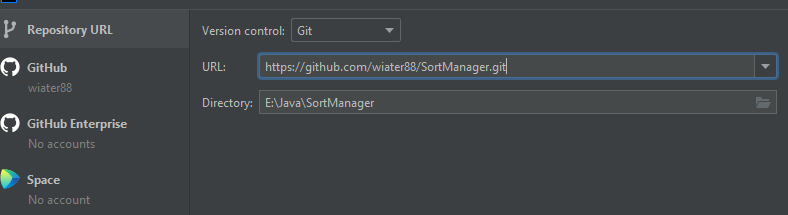

# Sort Manager App
> Application allow user to compare sorting performance of one (all) of the following algorithms.
> - [Bubble sort](https://en.wikipedia.org/wiki/Bubble_sort)
> - [Merge sort](https://en.wikipedia.org/wiki/Merge_sort)
> - [Quick sort](https://en.wikipedia.org/wiki/Quicksort)
> - [Binary Tree sort](https://en.wikipedia.org/wiki/Binary_search_tree)

## Table of Contents
* [General Info](#general-information)
* [Technologies Used](#technologies-used)
* [Features](#features)
* [Screenshots](#screenshots)
* [Setup](#setup)
* [Usage](#usage)
* [Project Status](#project-status)
* [Room for Improvement](#room-for-improvement)
* [Contact](#contact)
<!-- * [License](#license) -->

## General Information
- Application created as part of my sparta global training
- Sort App allow user to create custom size array with random values and compare sorting algorithms performance

## Technologies Used
- SOLID 
- OOP
- Adapter design pattern
- Factory design pattern
- Collections
- Random
- jUnit
- Log4j
- MVC
- Exceptions
- Scanner

## Features

- Creating custom size array (maximum 1.000 elements) with random values (1-10.000)
- Option to test performance of each individual algorithm or all algorithms at once 
- CLI (command line user interface )

## Screenshots

## Setup
In order to use this application please clone repository onto your local machine
1. Use this link (https://github.com/wiater88/SortManager.git) (click on icon) 

2. Open your IntelliJ (or any other IDE of your preference ) 
3. Create New > Project from version control 
 
4.Paste repo link (URL) & select where project will be saved. Click clone on bottom.

5.Once project is opened, load Maven build (pop up in right-hand corner)

## Usage
In order to run application please got to "Main class"
>src/main/java/com/sparta/Main.java

and click green arrow next to line 11

When application starts all control will be done via command line 

**No other option than displayed would not be allowed** (*program will check if your input is correct*)

## Project Status

*Project is currently completed as per MVP sparta requirements*

## Room for Improvement

- Additional sorting algorithms to be implemented
- GLI to be implemented 

## Contact
Created by [Piotr Wiatr](https://www.linkedin.com/in/piotr-wiatr-310980171) - feel free to contact me!

